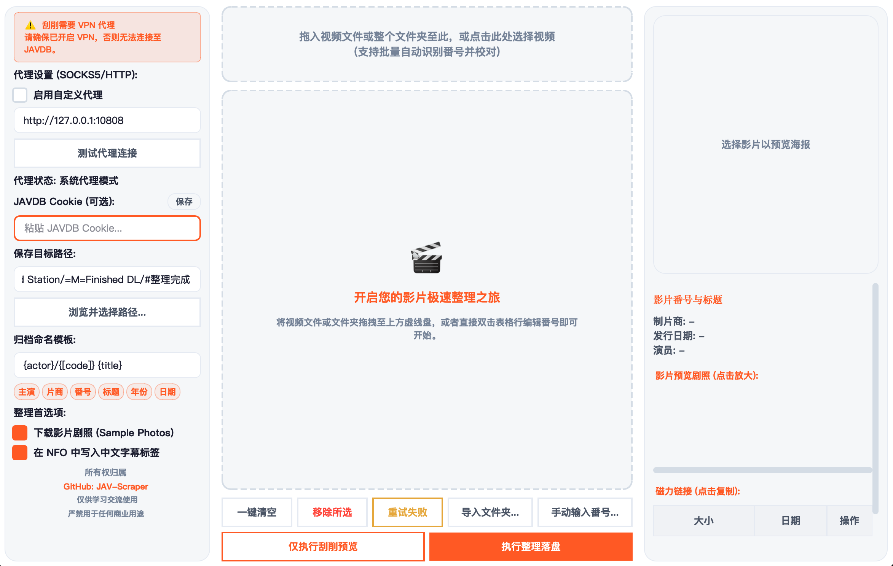

# 🏷️ JAV SCRAPER

<div align="center">
  <p><b>高性能、多线程异步 JAV 影片本地整理与元数据刮削利器</b></p>
  <p>
    <a href="#-开源协议"></a>
    
    
  </p>
</div>

---

## 📷 软件截图



---

## 🚀 核心功能

1. **智能番号识别与清洗**：
   * **广告水印清洗**：自动识别并剔除文件名中含有的发布站网址、域名、水印前缀（如 `hhd800.com@`、`www.xxx.net` 等），还原纯净番号。
   * **中文字幕标识别**：智能提取数字后紧跟 `C` / `c` 的字幕标识（如 `CESD194C` -> `CESD-194`），并在 NFO 中写入中文字幕标签。
   * **自动规范格式**：自动将番号中的小写英文字母纠偏转化为规范的大写（如 `ipx-123` -> `IPX-123`）。

2. **多线程异步秒级刮削**：
   * **界面零卡顿**：网络请求和磁盘 I/O 均在独立的后台线程中执行，加载大图自动异步化，软件界面始终保持极速流畅响应。
   * **多源自愈与灾备降级**：首选 JAVDB 刮削，若网络超时、风控 403 阻断或无匹配影片，程序会自动降级切换至 `JAV321` 发起直连灾备抓取，实现无感自愈。

3. **一键物理整理落盘**：
   * **主演二级归档**：提取演员列表的第一位作为首选主演（若无则归入“未知演员”），按照 `保存目标路径/首选主演/[番号] 标题/` 的树状二级目录进行物理移动归档。
   * **跨磁盘/外接盘兼容**：自动绕开跨挂载分区、外接盘（如 exFAT/NTFS 格式）在移动文件时由于 POSIX 权限写入被拒导致的报错，优先使用 `rename`，失败时平滑降级为物理数据流拷贝与源文件抹除组合，确保外接盘整理坚如磐石。

4. **Emby / Jellyfin 兼容元数据**：
   * 自动生成标准的 Emby/Jellyfin 兼容 `.nfo` 元数据 XML 文件。
   * 自动下载 `poster.jpg` 封面，并开启 8 线程高并发下载剧照样品（Sample Photos）至 `extrafanart/` 目录。

5. **极致便捷的交互设计**：
   * **双击自动重刮**：可直接在表格中双击番号进行手动修改，按下回车保存后，后台将立刻自动拉起二次异步刮削。
   * **0 毫秒图片缓存**：部署高性能内存缓存系统，缩放好的本地/网络海报和剧照一次加载后永久缓存，上下切换行时 **0 毫秒秒开** 呈现，绝无重复读取和昂贵的 CPU 缩放计算开销。
   * **一键重试失败任务**：对于因网络抖动、磁盘占用等偶发报错的任务，点击 **“重试失败”** 按钮即可一键将其重归队列并重新投递执行。
   * **文件夹智能安全清理**：移动整理完成后，自动检测已空的原父文件夹，并在确保非系统敏感目录前提下，单次询问并一键安全清理残留空目录（忽略 `.DS_Store` 等隐藏文件）。

---

## 📦 多版本 GUI 支持

本软件提供两种版本以适配不同用户的需求：

### 1. Python 开发版 (跨平台)
* **适用平台**：macOS、Windows、Linux
* **运行方式**：安装 Python 3.9+ 环境和依赖库后，在终端中直接运行入口脚本：
  ```bash
  python3 main.py
  ```
* **特点**：适合开发者与高级用户，方便随时进行二次重构和功能扩展。

### 2. macOS 独立运行版 (免安装 DMG)
* **适用平台**：Apple Silicon / Intel macOS 12+
* **运行方式**：双击直接打开内置的一键 DMG 磁盘映像文件安装，拖入“应用程序”文件夹即可使用。
* **特点**：**无需配置 Python 环境，零依赖，双击即用**。已在打包中配置了 CFBundle 描述信息，完美适配 macOS 隐私权限管理（支持文档、下载、桌面、网络共享卷/NAS 和移动硬盘的物理访问）。

### 3. Windows 独立运行版 (.exe)
* **运行方式**：通过内置的打包脚本，在一台 Windows 电脑上运行即可编译生成单文件 `.exe` 可执行程序，双击即用。

---

## 🛠 快速开始 (Python 版本)

### 1. 安装依赖
确保您的系统已安装 Python 3.9+。在终端中运行以下命令安装必要的 GUI 框架和网络组件：
```bash
pip install -r requirements.txt
```

### 2. 启动应用
在项目根目录下直接运行主入口脚本：
```bash
python3 main.py
```

### 3. 一分钟上手指南
1. **设定目标路径**：点击左下角 **“浏览并选择路径...”** 选定您希望归档到的硬盘根目录（软件会自动记住选择，下次打开无需重复设定）。
2. **填入 Cookie (可选)**：如果您有 JAVDB 账号，可直接粘贴 Cookie 字符串并点击 **“保存”**。输入框内容会在输入时自动静默持久化。
3. **导入视频**：
   * **方法 A**：将任意视频文件或包含视频的文件夹，直接鼠标拖入中部的虚线金边提示区。
   * **方法 B**：点击虚线提示区任一处，在弹出的文件浏览器中多选视频导入。
   * **方法 C (虚拟刮削)**：点击 **“手动输入番号...”** 直接添加无视频的虚拟任务，仅刮削元数据、海报与剧照样品。
4. **即时刮削与编辑**：
   * 导入视频后，后台会自动识别号码并在后台线程池中**自动拉起多线程刮削**，秒级呈现场景细节。
   * 若提取不准确，可直接双击番号列，修改完成后按下回车，程序会**立刻自动为您拉起二次多线程刮削**。
5. **一键整理落盘**：
   * 点击底部醒目的金色 **“执行整理落盘”** 按钮，开始重命名、移动并生成本地 `.nfo` 和图片。
   * 整理成功后，点击列表行，右下角将自适应回显其**整理后物理绝对路径**，方便快速定位和欣赏。
6. **重试失败**：
   * 若个别任务因网络波动等原因报错，点击控制栏的 **“重试失败”** 按钮即可一键重新投递执行！

---

## 📦 编译与打包

### macOS 平台打包 (生成 DMG)
在 macOS 本地终端运行以下命令：
1. **编译应用**：
   ```bash
   bash build_mac.sh
   ```
   该脚本会自动转换生成 `.icns` 图标并在 `dist/` 目录下生成 `JAV SCRAPER.app` 应用程序。
2. **制作 DMG 安装包**：
   ```bash
   bash build_dmg.sh
   ```
   打包成功后，可在 **`dist/`** 目录下获取 **`JAV_SCRAPER_macOS.dmg`** 映像文件。

### Windows 平台打包
在 Windows 终端中运行或直接双击项目根目录下的：
```bat
build_win.bat
```
脚本会自动配置 Windows 依赖并编译生成免安装的 `.exe` 独立应用程序，输出于 `dist/` 目录。

---

## 🧪 开发者单元测试 (TDD)

为确保任何逻辑修改不会对原业务产生 Regression 倒退隐患，您可以在终端中直接运行全量测试，验证项目的极佳健康度：
```bash
python3 -m pytest -v
```

---

## 📄 开源协议

本项目基于 **[MIT License](LICENSE)** 协议开源。可免费用于个人本地娱乐或进行二次重构和优化。
