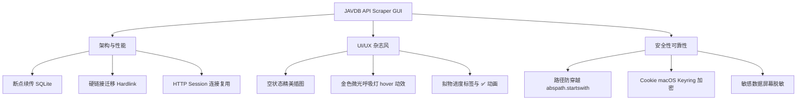

# JAVDB API Scraper GUI 项目深度优化与安全性分析报告

本报告针对 JAVDB API Scraper GUI 项目的当前代码实现、架构设计、用户体验（UI-UX）及安全与稳定性，进行系统性剖析，并提出下一阶段的升级路线与优化建议。

---

## 1. 架构与性能优化分析

### 1.1 断点续传与持久化任务队列
* **现状**：
  目前任务队列完全维护在内存中的变量 `self.task_files` 字典里。如果用户在整理或刮削大量视频时程序关闭、重启或发生意外，之前所有的文件状态、刮削好的元数据、整理状态将全部丢失，再次打开必须重新导入并重新向平台发送请求，耗费大量时间和宽带。
* **优化建议**：
  - 引入极简的文件级本地数据库（如 **SQLite**）或轻量级 JSON 存储。
  - 实时持久化每次导入的任务列表及其阶段状态（`Pending`, `Scraped`, `Organized`, `Failed`）。
  - 启动时自动恢复未完成的任务，支持“断点续传”和“批量重试”，极大提升大型整理场景的健壮性。

### 1.2 磁盘 I/O 异步化（shutil.move/copy 线程安全）
* **现状**：
  在 `ScrapeWorker` 中，虽然网络图片下载通过线程池并发了，但在执行整理落盘时，视频源文件到目标路径的移动是通过 `shutil.move` 进行的。
* **优化建议**：
  - 如果源文件夹与目标路径跨越不同的硬盘分区/文件系统，`shutil.move` 会退化为完整的物理复制（Read-Write-Delete），这将瞬间耗尽背景单线程资源，导致表格状态显示为“整理中...”而实际单卡片极其漫长。
  - 提议将视频文件移动解耦为非阻塞的 I/O 通知流，或增加对同一物理驱动器的极速“硬链接（Hardlink）”/“软链接（Symlink）”迁移选项供用户选择，免去大文件跨分区移动的等待。

### 1.3 爬虫层连接复用与限流降级
* **现状**：
  虽然对 `scrape_pool` 限制了并发数（最大线程数 3），但在多线程频繁调用 `AdapterFactory.get_adapter_by_name` 时，存在重复建立 TCP 连接的开销。
* **优化建议**：
  - 采用 **Requests.Session** 保持持久的 TCP Keep-Alive 连接，显著缩短单次 HTTP 请求的握手延迟。
  - 引入更健全的**自动避让机制（Backoff限流）**：检测到平台返回 `403` 或 `429` 时，自动进入降级模式，延长刮削间隔时间，防止平台封锁代理 IP。

---

## 2. UI-UX 杂志级白金美化与交互体验

### 2.1 任务列表空状态引导 (Empty State Graphic)
* **现状**：
  启动程序时，主任务表格 `QTableWidget` 呈现为一个空洞的黑色底盘，缺乏视觉中心与明确的高级感。
* **优化建议**：
  - 当列表为空时，在 `QTableWidget` 中央动态浮现精美的一体化矢量空状态占位图与优雅的文本描述（例如：“开启您的影片极速整理之旅 - 拖入视频或目录即可开始”），引导交互。
  - 引入渐变过渡微动画，淡入淡出。

### 2.2 极致视效微光（Micro-Animations & Visual Polish）
* **现状**：
  按钮和拖拽区只有硬朗的 hover 背景色切换，缺乏高级的现代 UI 动感。
* **优化建议**：
  - 使用 PySide 的 `QPropertyAnimation` 对按钮加入 150ms 的呼吸光晕与缩放微动。
  - 拖拽进入区域时，对虚线框增加流畅的淡金色呼吸灯动画（Border Color Pulse），进一步契合极简白金暗黑杂志风。

### 2.3 任务状态的拟物进度条与高对比度标签
* **现状**：
  “当前状态”列仅纯文本输出（如 `正在下载预览图 (5/35)...`），用户很难一眼感知全局进度。
* **优化建议**：
  - 在“当前状态”列嵌入小巧、高对比度的金色扁平进度条 `QProgressBar`，并在整理完毕时以动画缩放形式呈现绿色的圆点 ✅ 标签，视觉信息传达更迅速。

---

## 3. 安全性与可靠性深剖

### 3.1 路径防呆与非法写拦截 (Path Traversal & Safe Path Write)
* **现状**：
  虽然我们在第十三轮重构中引入了 `sensitive_paths` 保护，在文件夹清理时成功拦截了主目录、桌面、下载目录等。但在以下几个底层细节上仍需构筑防护墙：
* **防护建议**：
  - **路径穿越防御 (Path Traversal Prevention)**：在从网页端（如 JavDB, JavBus）抓取影片番号或标题后，我们会自动过滤非法字符并构建 `folder_name`。需百分之百确保拼装的目标文件夹没有发生路径退回（如 `../` 或绝对路径篡改）。
  - 在创建 target_folder 前，始终执行 `os.path.abspath(target_folder).startswith(os.path.abspath(output_dir))` 逻辑判别，将写操作严密锁定在用户指定的输出目录下。

### 3.2 Cookie 的加密落盘与防泄漏保护
* **现状**：
  目前 JAVDB 的 Cookie 是明文保存在本地 `config.json` 或配置中的，极易被本地其他恶意软件读取。
* **防护建议**：
  - **数据脱敏**：敏感的 Cookie 内容在展示时以 `******` 代替，避免屏幕共享或录屏时敏感账户数据泄露。
  - **系统钥匙串结合**：Cookie 落地持久化时，针对 macOS 系统接入原生钥匙串加密（利用 Python 库 `keyring`），非对称加密存储，杜绝明文风险。

### 3.3 非阻塞弹窗安全隔离 (Modality Safety)
* **现状**：
  目前主线程中使用的是模态对话框 `QMessageBox.question` 提示用户是否清理空目录，这会阻断整个 GUI 主界面的渲染。
* **防护建议**：
  - 尽可能使用 Qt 的信号机制将对话框展示控制在安全的 GUI 回调中，对用户提示使用非阻塞层级悬浮通知（Toast Banner），仅在最关键的安全决策（如删除文件夹）时才调用模态强阻断。

---

## 4. 后期升级建议脑图

